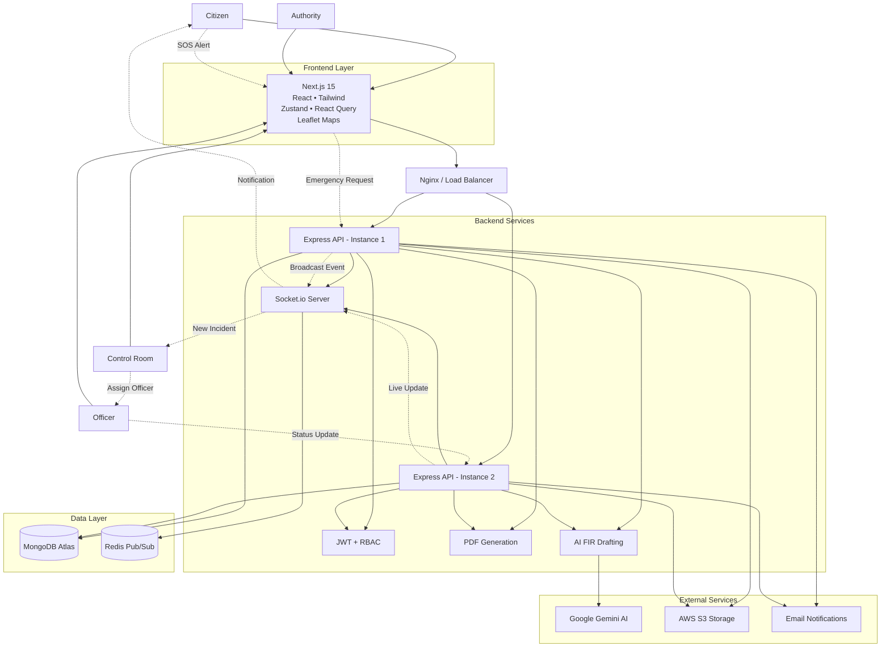
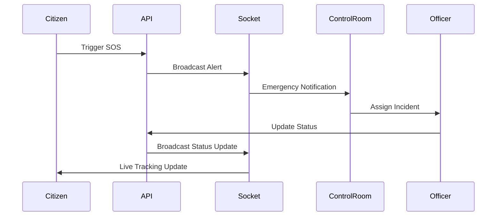
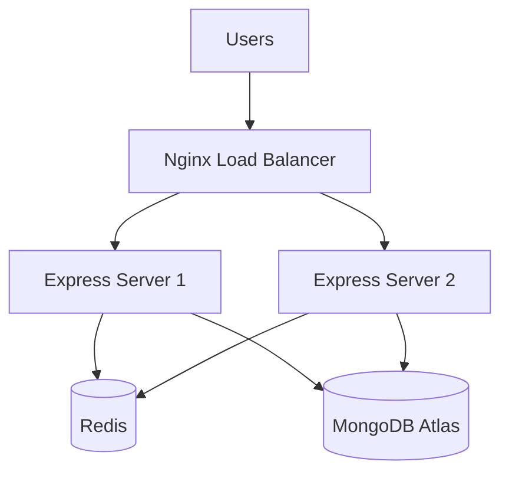

# SecureNET System Architecture & Design

The platform is designed to handle thousands of concurrent real-time connections by utilizing Redis as a pub/sub message broker across multiple Node.js instances.

## Architecture Diagram

SOS REAL TIME FLOW

DEPLOYEMENT ARCHITECTURE

## Component Breakdown

### 1. Client Layer
- **Citizens & Users:** Access the platform to file FIRs, report emergencies, and track statuses.
- **Law Enforcement:** Access admin dashboards to view heatmaps, manage FIRs, and respond to incidents.

### 2. Frontend Layer (`apps/web`)
- **Next.js 15:** Provides Server-Side Rendering (SSR) and optimized static delivery.
- **React 18 & Tailwind CSS:** For building responsive, accessible, and fast user interfaces.
- **Leaflet:** Handles mapping for emergency heatmaps and location tracking.
- **Zustand & React Query:** Used for global state management and efficient server data fetching/caching.

### 3. Backend Layer (`apps/api`)
- **Node.js + Express:** Handles RESTful routing and business logic.
- **Socket.io:** Maintains real-time WebSocket connections with clients for instant emergency alerts and chat functionality.
- **Security & Validation:** Uses `zod` for data validation, `bcryptjs` for password hashing, and `jsonwebtoken` for secure session management.
- **PDF Generation:** Utilizes `pdfkit` to dynamically generate downloadable FIR documents.

### 4. Data Layer (`config/db.ts` & `Redis`)
- **MongoDB:** The primary database, accessed via `mongoose`. Stores users, FIR reports, emergency logs, and geospatial data.
- **Redis:** Operates as a Pub/Sub message broker via `@socket.io/redis-adapter`. This is critical for scaling; if you run multiple instances of your Backend API, Redis ensures that a WebSocket message sent to Server A is seamlessly broadcasted to users connected to Server B.

### 5. External Services
- **AWS S3 (via `aws-sdk`):** Used to store uploaded evidence, photos, or documents securely.
- **Google GenAI (`@google/genai`):** Integrates AI capabilities, likely for analyzing reports, summarizing incident details, or NLP tasks.
- **Nodemailer:** Handles outbound email communications, such as confirming FIR registrations or sending critical alerts.
