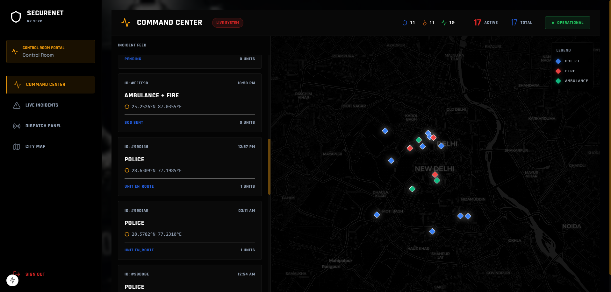
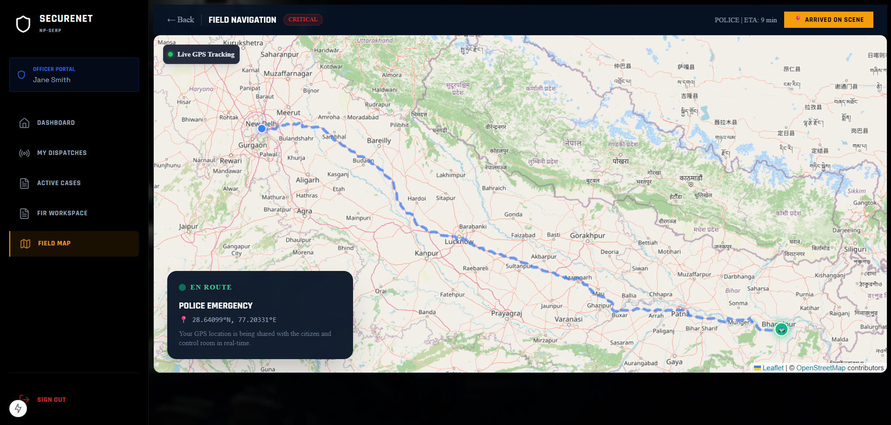

# SecureNET - Maps Demonstration

SecureNET incorporates an advanced real-time mapping system to ensure rapid response and clear situational awareness for both the command center and units in the field.

## Command Center Map

The **Command Center** provides operators with a bird's-eye view of all active incidents across the city. 

### Key Features:
- **Live Incident Tracking**: Visualizes active cases (Police, Fire, Ambulance) with distinct markers on the city map.
- **Real-time Dispatch Status**: Operators can monitor active emergency signals and track responding units.
- **Dark Mode UI**: Optimized for command center environments to reduce eye strain during continuous monitoring.

---

## Field Navigation & Live GPS Tracking

Field units (Police, Fire, Medical) have access to dedicated **Field Navigation** systems that track their route in real-time.

### Key Features:
- **Live GPS Tracking**: Plots the the optimal route from the unit's current location to the emergency scene.
- **Dynamic ETA**: Displays live Estimated Time of Arrival updates.
- **Cross-Platform Visibility**: The exact location of the responding unit is shared synchronously with both the citizen in distress and the central control room.

> **Note**: To ensure the images render correctly on GitHub, please save your screenshots as `command_center_map.png` and `field_navigation_map.png` in the `images` folder of this repository.
